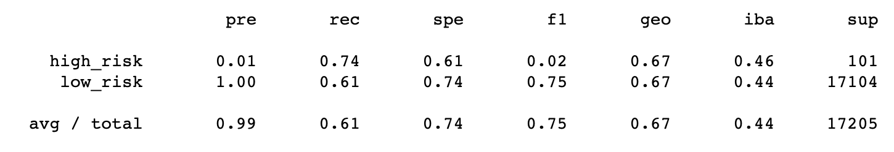
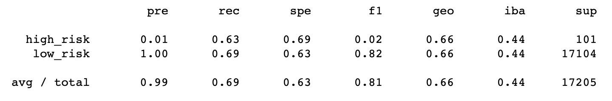
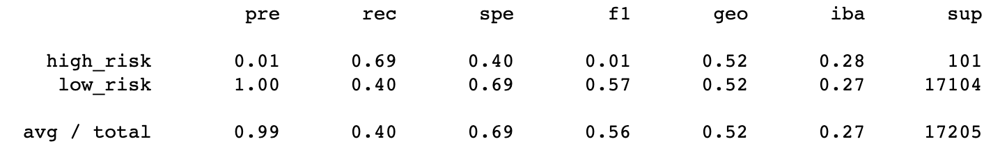
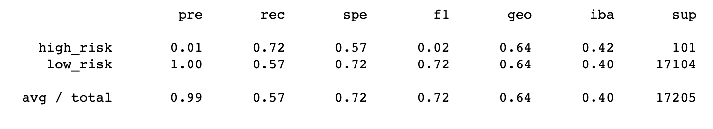
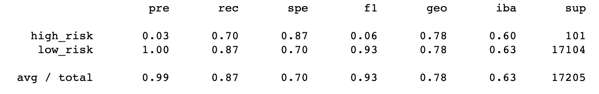
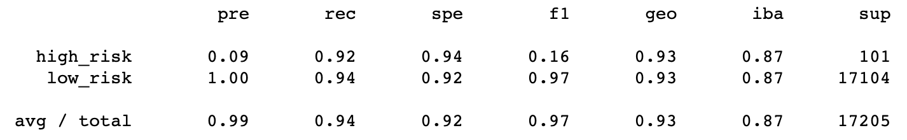

# Credit Risk Analysis - Berkeley DA
Yae Jin Park\
Module 17 - Supervised Machine Learning and Credit Risk

## Overview
There are many ways to improve a ML model depending on how the input data is in terms of balance, quantity (in samples), and etc. The main objective of this assignment is to explore some of these methods by applying them on several models formed to fit a dataset of people's loan status and their financial information. Some methods will work better than the others, and depending on their performance, an analyst would decide which method is suited best for an analysis. A total of six methods for oversampling, undersampling, and or ensemble learning was explored.

NOTE 1: For accuracies of each models, please refer to the two jupyter notebooks in this repository.\
NOTE 2: Due to the file size, LoanStats_2019Q1.csv is not included in this repository. Please place one in the same hierarchy level as the Jupyter notebooks if you decide to run the code without error.

### Oversampling
#### Naive Random Oversampling

Accuracy: 67.426%

#### SMOTE Oversampling

Accuracy: 66.234%

### Undersampling - Cluster Centroids

Accuracy: 54.418%

### Combination of Over and Undersampling (SMOTEENN)

Accuracy: 64.477%

### Ensemble Classifiers
#### Balanced Random Forest Classifier

Accuracy: 78.875%

#### Easy Ensemble AdaBoost Classifier

Accuracy: 93.16%

## Summary

For the methods of oversampling, undersampling and the combination of both, the accuracy ranged from 54% to 67%. The two ensemble classifiers performed significantly better, ranging from 78% to 93%. All six methods scored 0.99 in average precision, which may seem great, but their recalls ranged from 0.40 to 0.94. Methods that have high precision but low recall will likely mark more false negatives than those that have high recall, which means that many of actual loans that indicate high credit risks will not be marked as such. The best method would have a balance between these two metrics, and in this case, that is the AdaBoost Classifier. 

Although the AdaBoost Classifier is the recommended method, this does not mean it will always be for all other datasets and models. If more data with more features were included, there is no guarantee that the six methods would score similarly as this analysis. It's a cliché, but more data might help analysts to make more recommendations or none.

